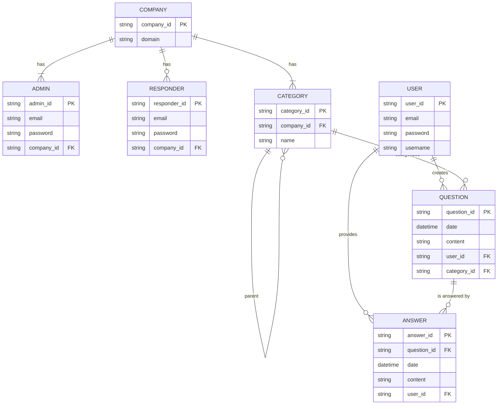

# Gunma-Backend

## 動作確認
1. `.env.example`→`.env`にリネームします。また特有の環境変数があれば埋めます
2. dockerでgoの実行環境を用意します
```bash
docker compose up -d
```
3. 実行環境に入ります
```bash
docker exec -it gunma-backend /bin/bash
```
4. デバッグします
```bash
go run main.go
```

## ER図

